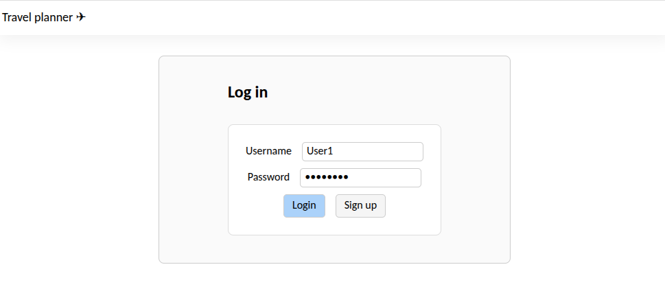
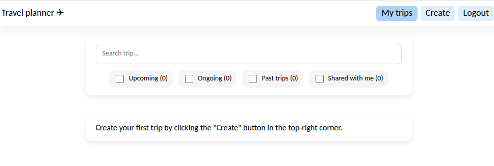
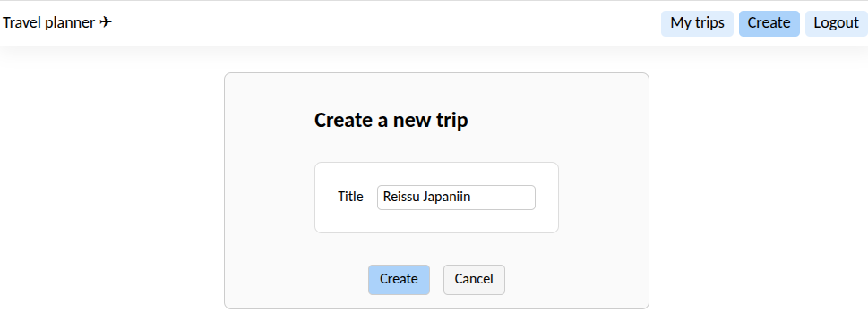
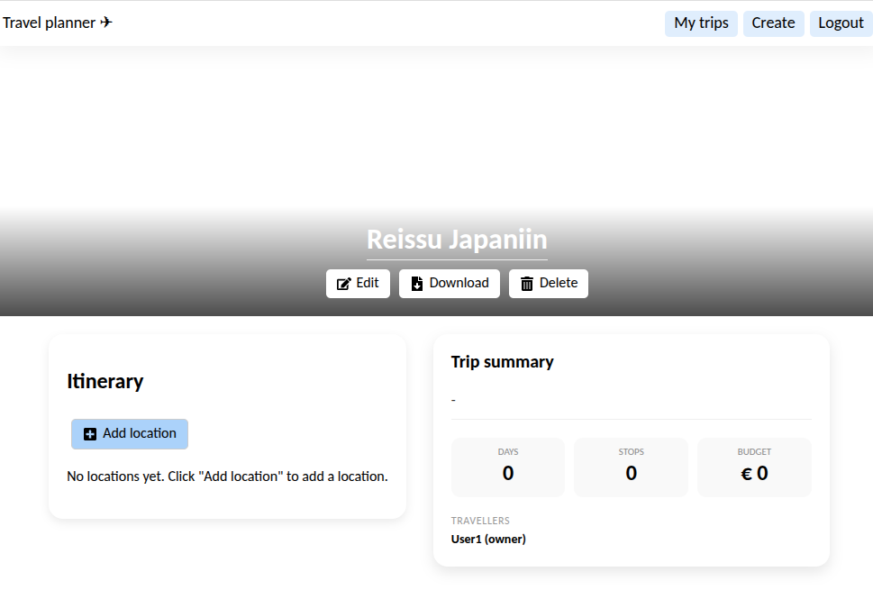
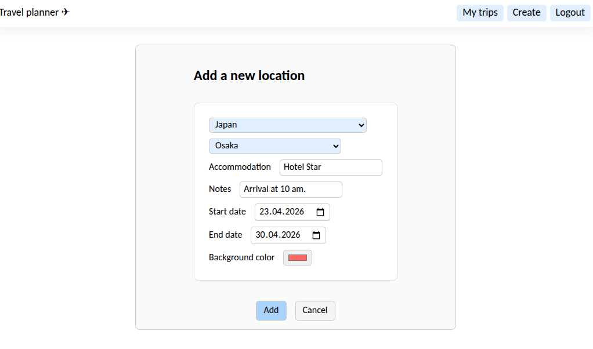
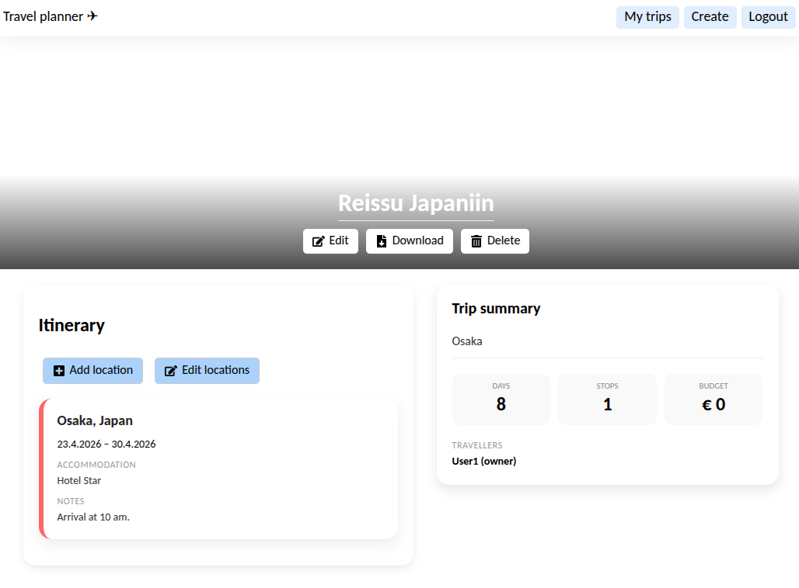
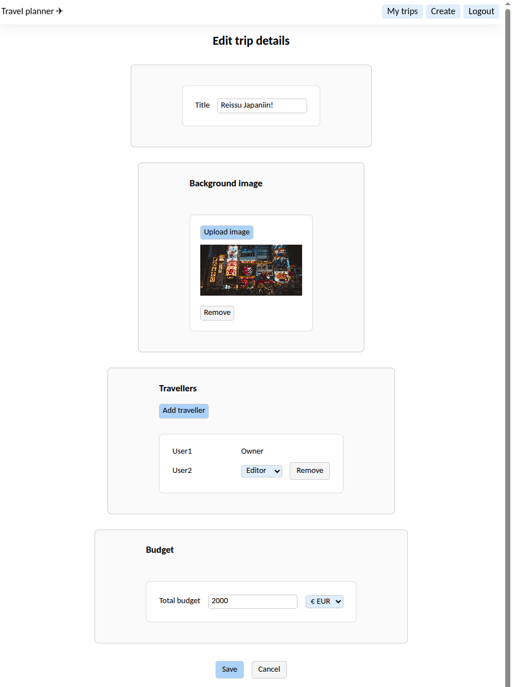
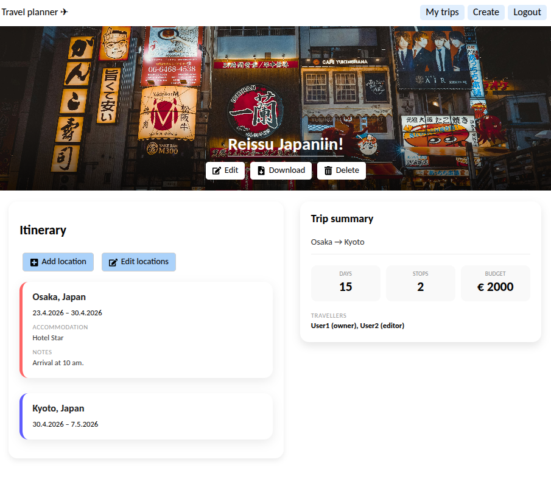
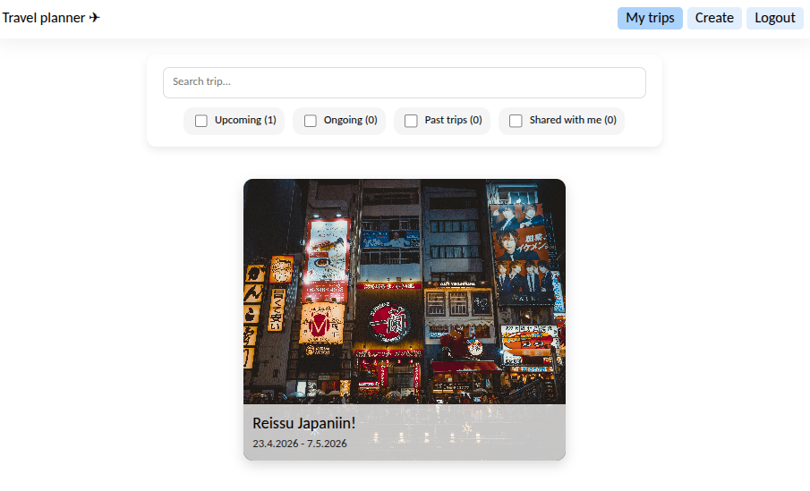

# Instructions

Open page https://travel-planner-app-mrz5.onrender.com/.

## Login and signing up

You can login to an existing account from the login page:

Create a new account by clicking "Sign up" in the login view.

## Creating a trip

Once logged in you can create a new trip plan by clicking the "Create" button in the top-right corner:

Once you have entered a title for the trip, click "Create".

## Trip details

After creating a trip, the trip details view will open. 

Add a location to the trip by clicking "Add location" button under "Itinerary".

After filling in the location details click "Add".

Now you can edit the existing locations by clicking the "Edit locations" button which appeared next to the "Add locations" button.
Under the trip title at the top of the page you can see 3 buttons: "Edit", "Download" and "Delete". By clicking "Download", you download the trip as a PDF file. "Delete" button deletes the trip.  By clicking the "Edit" button, the following page opens:

Here you can edit the title, add an background image for the trip view, create a bugdet and add/manage traveller information for the trip. You can add other users as travellers and choose either "Reader" or "Editor" role for them. Editor can edit the trip but can't delete it or edit the travellers information. Reader can only view and download the trip. The trip will show up in all the trip travellers home pages.

Now by clicking the "My trips" button in the top-right corner you open the home page again. There you can see all your trips and filter + search them. Open any existing trip by clicking it in the home page view.

Logout by clicking "Logout" in the top-right corner.
